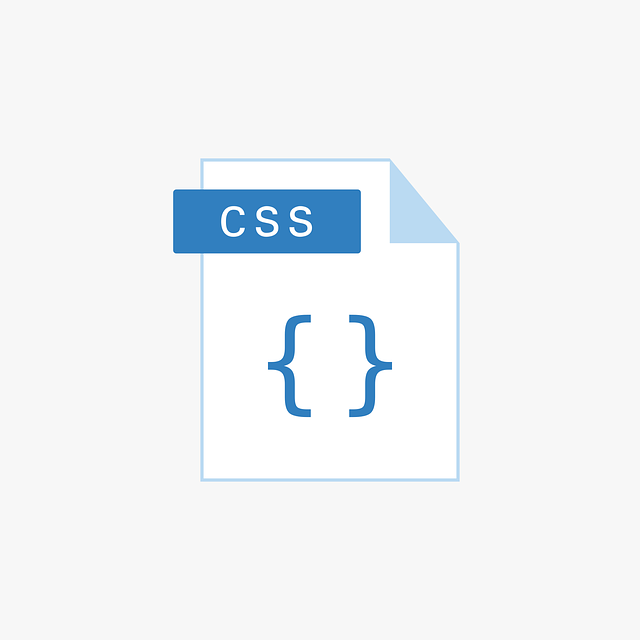

# Introduction to CSS

### Content:

1. What is CSS?
2. Anatomy and syntax
3. Stylesheets

## What is CSS?

CSS stands for **Cascading Style Sheet** and is a programming language used to *style* HTML elements.

<br>
<p align="center" >
  
</p>
<br>

To *style* means to visually edit a HTML element. This could be colour, sizing, positioning ect..

CSS is crucial for web developers as this is how you make web pages visually pleasing.

## Anatomy and syntax

There are two different ways of writing CSS code.

### Ruleset

The first syntax is as a *ruleset*, as shown below

```
p {
  color: red;
}
```

which is made up of the following properties:

1. a selector, in this case it's a `p` element
2. a property, in this case it's font colour denoted by `color`
3. a value, in this case it's `red`

The above example would set all `p` elements to have a red font colour.

### Inline styling

The second syntax is *inline styling* and is written as an attribute to a HTML tag.

```
<p style="color: red;">Hello world</p>
```

The above line of code would change just this specific `p` element to have a red font colour.

### CSS selectors

So far we have seen that a `p` can be used as a CSS selector for all `p` elements in a HTML document. 

This is an example of a selector for all `p` elements, however there are times when you may wish to only style a select number of `p` elements.

**Classes**

Classes are added to HTML elements in the opening tag as an attribute.

For example

```
<p class="red-text">Hello world</p>
```

This `p` element is given the class name of "red-text".

We can then use this class name as a CSS selector as shown below.

```
.red-text {
  color: red;
}
```

Notice the `.` before the class name.

If there was another element which we wanted to have red text (or any other property listed in this class) we can add the same class attribute with the same class name.

For example

```
<h3 class="red-text">My red title</h3>
```

This is useful for keeping styling consistent across a web page or even web pages. This also saves time in writting out code as you don't have to repeat yourself with writing the same CSS for different elements.

**Id**

Id's are another example of a CSS selector.

These are applied to an individual element as an attribute with an id name.

For example

```
<p id="blue-text">Big blue</p>
```

The example above has an id name of "blue-text".

This can be used as a selector like so

```
#blue-text {
  color: blue;
  font-weight: bold;
}
```

Notice the `#` before the id name.

In the code example above we have set the font colour to blue and the font-weight (thickness) to bold.

Id's are unique to elements, therefore two HTML elements cannot have the same id name.

## Stylesheets

<br>
<p align="center" >
  
</p>
<br>

Stylesheets are where CSS code is written.

There are two types of style sheet:

1. Internal
2. External

### Internal

An internal stylesheet is written in a HTML document between a `style` tag.

For example

```
<style>
  p {
    color: red;
    font-size: 20px;
  }
</style>
```
In the example above, the `p` elements are set to be red and have a font size of 20px.

*Note: a 'px' is a unit of measurement is CSS. See more examples of CSS units [here](https://www.w3schools.com/CSSref/css_units.asp).*

Classes and id's can be added here as well.

### External

In general, it is a good idea to organise different types of code in their own files. So in addition to having a .html file, you can have a .css file with styling in this. This is an external stylesheet.

**Linking external stylesheets**

Now that the CSS code is seperate from the HTML code, how does a browser know to apply these styles to the HTMl document?

The solution is through linking!

This is done by adding a `link` tag to the `head` of a HTML document.

The following attributes are added to the link tag:

1. `href` - this is the location/path to the CSS file
2. `rel` - this is the relationship between the HTML and CSS file, in this case it is set to 'stylesheet'

```
<link href="./my-style-sheet.css" rel="stylesheet">
```

*Note: the location/path above is to a CSS file stored in the same directory as the HTML file.*

For more inforamtion on CSS and examples view this [link](https://www.w3schools.com/Css/css_examples.asp).

Now go over to Exercise sheet 2 to begin with writing CSS code!!