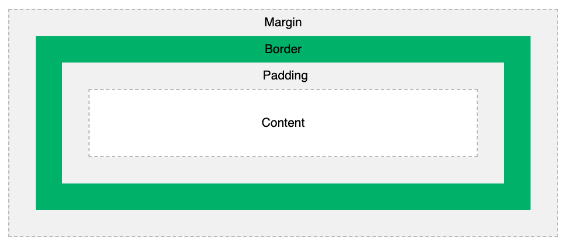
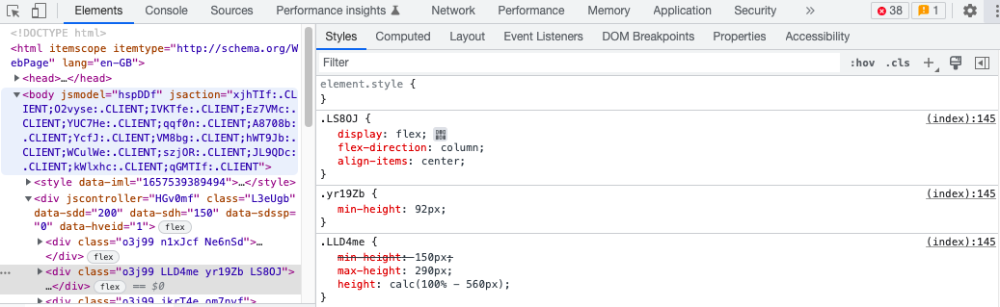

# Box Model

### Content

1. What is the box model?
2. How is CSS related?
3. Browser dev tools

## What is the box model?

When an element loads in a browser you may notice it has some defualt styling such as font size or colour.

It is common to want to change this default styling to create a better looking web page.

Each element on the page can be thought of as being contained in it's own 'box'. Each box can have the following properties:

- width
- height
- padding
- background
- margins
- border

## How is CSS related?

<br>
<p align="center" >
  
</p>
<br>

Through using CSS we can change the default browser styling and add our own to each element.

The CSS properties are as followed:

1. `width` and `height` are of the content area.
2. `padding` is the area between the content and border.
3. `background` property includes the content area and the `padding` area.
4. `margin` is the amount of space between the border and the next element on the page.
5. `border` is the outline of the content and `padding` areas. 

The `height` and `width` properties can be set using any valid CSS dimension e.g. `px` or `%`

The `background` property refers to the background colour of the element

Both `margin` and `padding` can be given a dimension using any valid CSS unit

For example

```
padding: 5px;
```

This will give an equal padding of `5px` around the content area.

However, if you wish to add different values for the padding in the vertical direction, you can do so by using the following notation

```
padding: 10px 5px;
```

This gives the padding above and below the content a value of 10px and the padding left and right od th content area a value of 5px.

The same notation is applied to the margins

#### Borders

Borders have three settings:

1. width/thickness
2. style
3. colour

For example

```
border: 2px solid orange;
```

In the above example the border of an element will be `2px` thick, be of a `solid` line and be `orange`

Read more about borders [here](https://www.w3schools.com/css/css_border.asp)

## Browser dev tools

Modern web browsers include a suite of useful tools called developer or 'dev' tools.

One of these includes a HTML/CSS inspection tool

This allows anyone to view the HTML source code for a web page and the styling for each element.

Another feature useful for web developers is that you can directly edit the styling of a HTML element in the browser!

Below is an image of Chrome dev tools for inspecting the HTML/CSS of Google

<br>
<p align="center" >
  
</p>
<br>

Under the **Elements** tab you can inspect HTML/CSS.

On the right hand side under the **Computed** tab you can view an individual elements CSS properties and box model of the element with dimensions, as shown below.

<br>
<p align="center" >
  
</p>
<br>

These tools are very useful to see how your code is working in the browser and to quickly see what CSS changes may look like without actually adding them to the code.