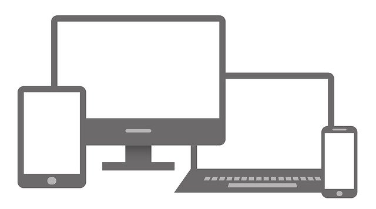
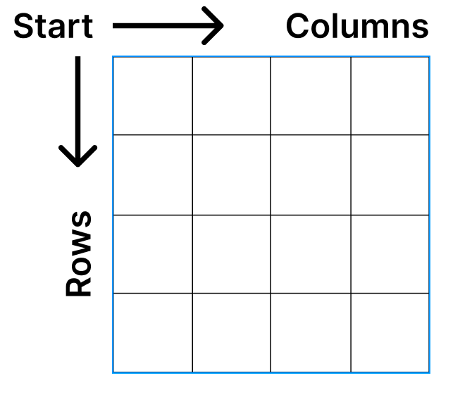

# Flexbox and grid

### Content

1. What is Flexbox?
2. Why it is useful?
3. Grids

## What is Flexbox

The Flexbox model is a way of laying out a webpage.

It is used to align elements both horizontally and vertically.

It is a property of `display` and is declared like so:

```
display: flex;
```

The first step is to define a flex-container by adding the above line of code.

Once the flex-container is in place, you can layout child elements using Flexbox properties.

Have a go at this [Flexbox Froggy](https://flexboxfroggy.com/) game to learn and test your knowledge of the Flexbox model.

## Why is it useful?

Flexbox model makes it easier to layout web pages.

It makes designing a responsive layout easier.

*Responsive means designing for multiple screen sizes*

<br>
<p align="center" >
  
</p>
<br>

It is also supported in all modern web browsers.

## Flexbox properties

### Flex-container

The constainer element which has the CSS property:

```
display: flex;
```

may have the following properties:

- `flex-direction`
- `flex-wrap`
- `justify-content`
- `align-items`

**flex-direction**

The `flex-direction` property defines which way (horizontally or vertically) the child elements are rendered. The direction is the direction of the main axis.

This property can either be:

- `row` for horizontally left-to-right (this is the default)
- `row-reverse` for horizontally right-to-left
- `column` for vertically top-to-bottom
- `column-reverse` for vertically bottom-to-top

For more information on `flex-direction` click [here](https://www.w3schools.com/cssref/css3_pr_flex-direction.asp)

**flex-wrap**

The `flex-wrap` properties defines whether child elements should *wrap* on to the next line if there is not enough space.

For example, if you had 5 items in a row in a flex-container. If you reduced the width of the container the 5 items can no longer all fit in a row. What happens next is dictated by `flex-wrap`.

Options:

- `nowrap` is the default beaviour and will try to fit all elements in one row
- `wrap` will allow items to go onto the nexdt row if there is not enough space, going from left-to-right
- `wrap-reverse` is similar to `wrap` however the items are displayed from right-to-left

**justify-content**

The `justify-content` property aligns items along the main axis of the container.

The way the elements are aligned depends on the value of this property.

Options:

- `flex-start` aligns items from the start of the container main axis
- `flex-end` aligns items from the end of the container main axis
- `center` centers all the elements in the middle of the main axis
- `space-between` spaces all the elements with equal space between each element and the first and last elements flush with the start and finish
- `space-around` is similar to `space-between` but gives the first and last elements a *half-space* between the edges of the container

**align-items**

The `align-items` property is similar to the `justify-content` property however addresses the cross-axis to the main direction/axis.

### Centering

A very common exercise in web development is to perfectly center an element relative to another.

This is easily achieved with the Flexbox model using the following code:

```
parent-element {
  display: flex;
  justify-content: center;
  align-items: center;
}
```

For more examples on the Flexbox model read the [freeCodeCamp article](https://www.freecodecamp.org/news/flexbox-the-ultimate-css-flex-cheatsheet/) and view [this page](https://www.w3schools.com/csS/css3_flexbox_container.asp).

## Grid

An alternative to the Flexbox model is the grid-based layout system.

This uses rows and columns to organise a web page layout making it easy to position and align items.

To use a grid layout, a parent grid container must be defined:

```
.grid-container {
  display: grid;
}
```

the parent element can have the following grid properties:

- `grid-template`: defines the columns, rows and areas in a parent container
- `grid-gap`: defines the size of the gaps between rows and columns

<br>
<p align="center" >
  
</p>
<br>

**Defining rows**

Rows can be defined in the following way:

```
.grid-container {
  display: grid;
  grid-template-rows: 1fr 100px 2fr;
}
```

This creates 3 rows:

1. the first has a height of 1fr or *a fraction*
2. the second has a height of 100px
3. the third has a height equal to twice the first row height

Rows go from top to bottom

In the above example, the first row, of size *1fr*, starts at the top. The last row, of size *2fr*, would be at the bottom of the grid area.

**Columns**

Grid columns are defined in the same manner as rows, except using

```
grid-template-columns: 1fr 100px 2fr
```

Columns go from left to right.

See [grid-template](https://www.w3schools.com/cssref/pr_grid-template.asp) for the shorthand delaration and see [grid-template-areas](https://www.w3schools.com/cssref/pr_grid-template-areas.asp) for an alternative was of defining grids.